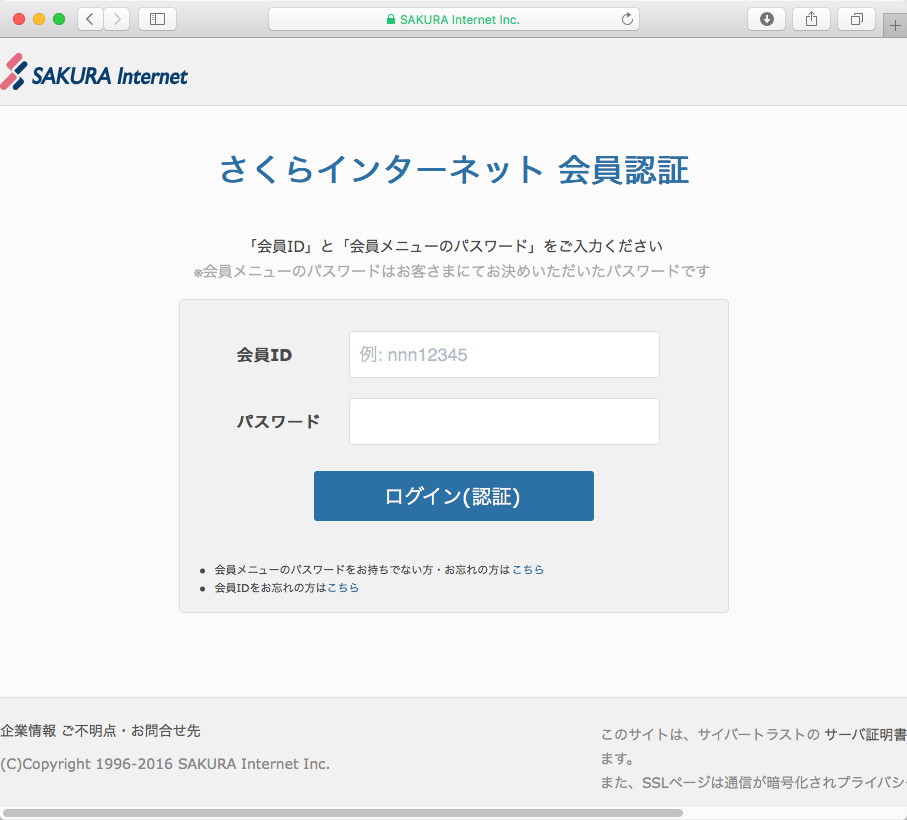
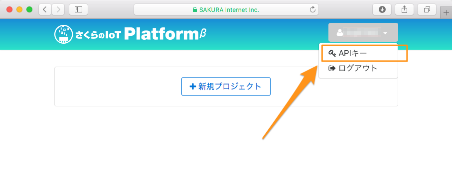
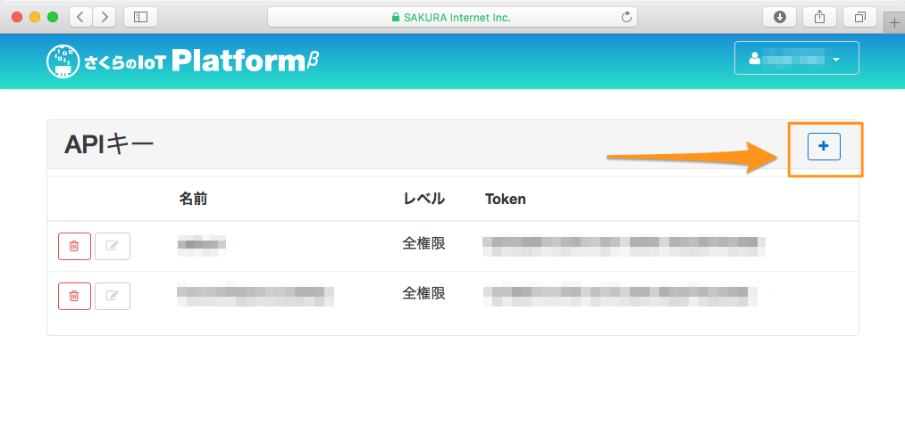
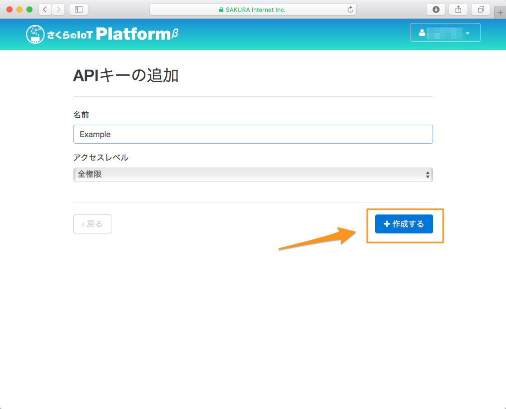
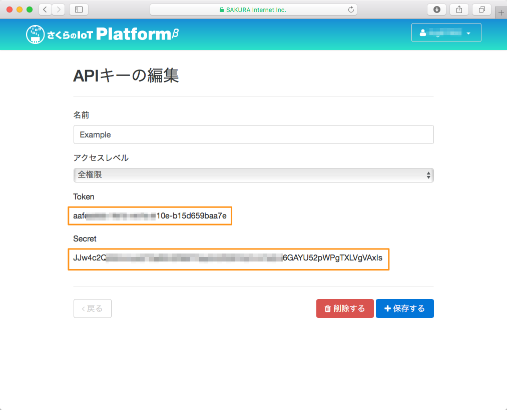

# Installation / インストール

## 目次

1. [Terraformのセットアップ](#terraformのセットアップ)
1. [Terraform for さくらのIoT Platformのセットアップ](#terraform-for-さくらのiot-platformのセットアップ)
1. [さくらのIoT Platform APIキーの取得](#さくらのiot-platform-apiキーの取得)
1. (付録)[Dockerでの実行](#dockerでの実行)

## Terraformのセットアップ

- 1) こちらの[公式サイト](https://www.terraform.io/downloads.html)からzipファイルのダウンロードを行います。
- 2) 適当なディレクトリに展開します。
- 3) 2)のディレクトリにパスを通します。

以下はMacでの例です。展開先ディレクトリは`~/terraform`として記載しています。

#### terraformインストール

```bash
# ~/terraformディレクトリ作成
$ mkdir -p ~/terraform ; cd ~/terraform
# ダウンロード
$ curl -L https://releases.hashicorp.com/terraform/0.8.2/terraform_0.8.2_darwin_amd64.zip > terraform.zip
# 展開
$ unzip terraform.zip
# パスを通す
$ export PATH=$PATH:~/terraform/

```

### 動作確認

`terraform`コマンドを実行してみましょう。
以下のような表示がされればOKです。

#### terraform動作確認 

```bash
$ terraform
usage: terraform [--version] [--help] <command> [<args>]

Available commands are:
    apply       Builds or changes infrastructure
    destroy     Destroy Terraform-managed infrastructure
    get         Download and install modules for the configuration
    graph       Create a visual graph of Terraform resources
    init        Initializes Terraform configuration from a module
    output      Read an output from a state file
    plan        Generate and show an execution plan
    push        Upload this Terraform module to Atlas to run
    refresh     Update local state file against real resources
    remote      Configure remote state storage
    show        Inspect Terraform state or plan
    taint       Manually mark a resource for recreation
    validate    Validates the Terraform files
    version     Prints the Terraform version
```

## Terraform for さくらのIoT Platformのセットアップ

- 1) こちらの[リリースページ](https://github.com/yamamoto-febc/terraform-provider-sakuraiot/releases/latest)から最新版のzipファイルをダウンロードします。
- 2) terraformと同じディレクトリに展開します。

#### terraform for さくらのIoT Platform インストール

```bash
$ cd ~/terraform
# ダウンロード
$ curl -L https://github.com/yamamoto-febc/terraform-provider-sakuraiot/releases/download/v0.0.1/terraform-provider-sakuraiot_darwin-amd64.zip > terraform-provider-sakuraiot.zip
# 展開
$ unzip terraform-provider-sakuraiot.zip

```


## さくらのIoT Platform APIキーの取得

さくらのIoT PlatformのコントロールパネルにログインしAPIキーを発行します。  
以下を参考に実施してください。APIキーを発行したら、`Token`と`Secret`を控えておきましょう。

#### さくらのIoT Platform コントロールパネルへのログイン

以下のURLからコントロールパネルを開き、ログインします。

[さくらのIoT Platform コントロールパネル](https://secure.sakura.ad.jp/iot/)

さくらインターネット会員IDとパスワードを入力してください。



#### APIキー一覧画面へ遷移

右上のボタンから「APIキー」メニューをクリックしてAPIキーの一覧画面へ遷移します。



#### APIキー作成画面へ遷移

右側の「＋」ボタンを押し、APIキー作成画面へ遷移します。



#### APIキーの作成

お好きな名前を入力し「作成する」ボタンを押します。  
アクセスレベルは「全権限」としておいてください。



#### 作成したAPIキーの表示

作成したAPIキーの`Token`と`Secret`が表示されますので控えておきます。



以上でAPIキー作成完了です。

APIキーは環境変数に設定しておくと定義ファイル(.tf)での記載を省略できます。(推奨)

```bash
$ export SAKURAIOT_AUTH_TOKEN="作成したAPIキーのトークン"
$ export SAKURAIOT_AUTH_SECRET="作成したAPIキーのシークレット"
```

## Dockerでの実行

手軽に試せるようにTerraformとTerraform for さくらのIoT Platformを同梱したDockerイメージを用意しています。

[Terraform for さくらのIoT Platform Dockerイメージ](https://hub.docker.com/r/yamamoto-febc/terraform-for-sakuraiot/)

以下のように実行します。

#### Dockerでの実行
```bash
# terraformコマンドをDocker上で実行するようににエイリアス作成
alias terraform="docker run -it --rm -w /work -v $PWD:/work -e SAKURAIOT_AUTH_TOKEN -e SAKURAIOT_AUTH_SECRET yamamotofebc/terraform-for-sakuraiot"

# インフラ構築実行
$ terraform apply
```
